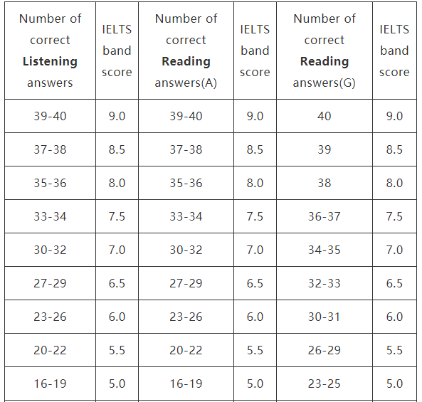
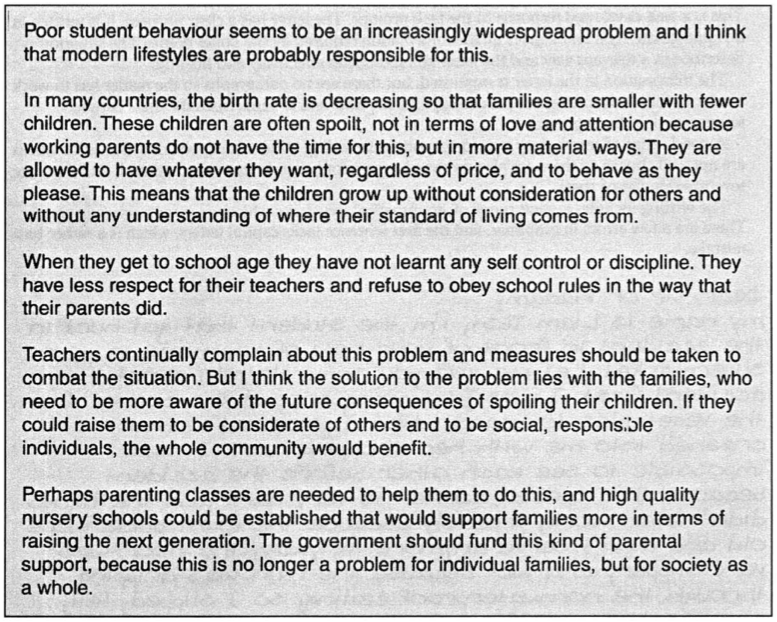

---
toc:
    depth_from: 1
    depth_to: 3
    ordered: false
---  
  
  
--- 
#  IELTS
  
International English Language Test System
  
#  OBJECTIVE
  

  
#  speaking
  
  
  
##  criteria
  
- Fluency and Cohesion 流利程度连贯性
- Vocabulary/Lexical resource 
    - 地道的词、搭配，参考《剑桥中级英语惯用搭配》
    - 习语(idioms) ==> the die is cast，参考《The English We Speak》
    - [避免重复](http://www.thefreedictionary.com '词典网址'), thesaurus 查找近义词
- Grammar range and accuracy 语法
    - risk taker, 敢于犯错
- Pronunciation 发音
    - 口音没问题
    - 发音网址：bbclearningenglish.com
    - 语调
  
  
##  part1
  
  
###  考察点
  
- Introduction and interview
- 3个日常生活话题，每个话题3~4个问题
- 4~5 分钟
  
###  studyOrWork
  
  
####  Q: Are you work or are you a student?
  
- major in sth
- (doing a)master's degree/bachelor's degree
- completed my master's degree
- ==Well, I work. Currently I'm working at Suzhou as a computer programmer. #TODO(苏州是个怎样的城市which)==
  
####  Q: What is your tipical working day like?
  
- I'am responsible for
- I'am in charge of
- ==My responsibilities involve #TODO==
  
####  Q: why did you choose that kind of work?
  
- ==I have always loved computer since I am a child. What's more/Besides It's well-paid. #TODO(loved换个词)==
- It has a promising future.
- graduates are in great demand.
- It's well-paid.
- There are good benefits and job security.
  
####  Q: What was the most difficult thing about your work/study?
  
- ==I found it really difficult to (quire precise and 精确及及时的知识) because there is a network restriction in china and English documents are hard to read.#TODO. But it's getting much better.==
- I'am working on it.
- It would have to be ...
    - tring to ...
    - dealing with ...
  
####  Q: What's your future study/work plan?
  
- I'am planning to ...
- I hope that in five years I will be doing ...
- ==I'd like to see myself in a management position in five years.==
- My goal is to set up my own bussiness.
  
  
###  hobbies
  
  
####  topics
  
- cooking
- music 
- dance
- art/photography
- reading
- sports
  
####  T: Answering Yes/No question
  
- Definitely
- Absolutely
- Not really
- Sort of/ Kind of
- It depends
  
####  T: Likes and Dislikes
  
- be into
- be fond of 
- be keen on 
- be big on
- not the least bit interested in 一点也不喜欢
- enjoy
- can't stand
- don't mind
- I can take or leave it
- a big fan of sb
- an avid(热衷的) reader/traveler
- a (history) buff
- It's not my kind of thing. It's not my cup of tea#idioms.
- I don't fell like it.
  
####  T: frequency
  
- 24/7
- all-time favorite
- once in a while (sometimes, 偶尔)
- every now and then (sometimes, 偶尔)
- rarely
- hardly ever
- once in a blue moon#idioms
- I can't remember the last time ...(i did sth)
  
####  T: describe feelings
  
- positive
    - therapeutic 治愈的
    - relaxing
    - exhilarating  令人激动的
    - touching/moving
    - thought-provoking 发人深思的
    - breath-taking 风景非常美丽
    - heart-warming 感人的
- negtive
    - tedious
    - dull
    - dreadful 很讨厌的
    - strenuous 很耗体力的
    - embarrasing
    - time-consuming
- I find it ... to do sth
- It feels ... to do sth
  
####  E: cooking
  

  
####  E: music
  

- tone deaf 无音不全
- line dance 广场舞
  
####  E: art/photography
  

- shutterbug 摄影爱好者
- photogenic 上镜
- scenery 风景
  
####  E: reading
  

- non-fiction 非虚构类的
- a page turner 好看的书
- best seller 畅销书
  
####  Q: Do you prefer to listen to live music or recorded music?
  
####  Q: What kind of musical instrument is popular in your country?
  
####  Q: When do people dance in your country?
  
####  Q: Do you prefer to take photos of others or to be taken photos of?
  
####  Q: Do you think you read enough?
  
  
  
###  familyAndFriends
  
  
  
  
  
##  part2
  
  
  
  
##  part3
  
  
  
  
##  recite
  
  
###  recite1
  
  
####  文章
  

  
####  单词/短语
  
- contemporary
- the vast majority of 
- opt for 
- as to
- to start with
- is easily accessible for
- nevertheless
- apparently
- perplex 困惑
- a jack of all trades
- at the same time
- in our competitive reality
- last but not least
- maternity leaves
- job perks
- in a nutshell
  
####  句子
  
- This essay will look into the key factors as to why people may prefer entrepreneurship and the major drawbacks of it.
  
  
###  recite2
  
  
####  文章
  

  
####  单词/短语
  
- increasingly widespread problem
- modern lifestyles
- spoil &nbsp; 宠坏/毁坏 &nbsp;&nbsp;（spoiled kids)
- in terms of &nbsp; 在什么方面
- regardless of &nbsp; 
- discipline &nbsp; 纪律
- be aware of
- combat the situation
- as a whole &nbsp; 作为一个整体
  
####  句子
  
- the solution to the problem lies with ...
- not ... but ...
  
  
  