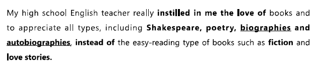

#### topics
- cooking
- music 
- dance
- art/photography
- reading
- sports

#### T: Answering Yes/No question
- Definitely
- Absolutely
- Not really
- Sort of/ Kind of
- It depends

#### T: Likes and Dislikes
- be into
- be fond of 
- be keen on 
- be big on
- not the least bit interested in 一点也不喜欢
- enjoy
- can't stand
- don't mind
- I can take or leave it
- a big fan of sb
- an avid(热衷的) reader/traveler
- a (history) buff
- It's not my kind of thing. It's not my cup of tea#idioms.

#### T: frequency
- 24/7
- all-time favorite
- once in a while (sometimes, 偶尔)
- every now and then (sometimes, 偶尔)
- rarely
- hardly ever
- once in a blue moon#idioms
- I can't remember the last time ...(i did sth)

#### T: describe feelings
- positive
    - therapeutic 治愈的
    - relaxing
    - exhilarating  令人激动的
    - touching/moving
    - thought-provoking 发人深思的
    - breath-taking 风景非常美丽
    - heart-warming 感人的
- negtive
    - tedious
    - dull
    - dreadful 很讨厌的
    - strenuous 很耗体力的
    - embarrasing
    - time-consuming
- I find it ... to do sth
- It feels ... to do sth

#### E: cooking

#### E: music

- tone deaf 无音不全
- line dance 广场舞

#### E: art/photography

- shutterbug 摄影爱好者
- photogenic 上镜
- scenery 风景

#### E: reading

- non-fiction 非虚构类的
- a page turner 好看的书
- best seller 畅销书

#### Q: Do you prefer to listen to live music or recorded music?
#### Q: What kind of musical instrument is popular in your country?
#### Q: When do people dance in your country?
#### Q: Do you prefer to take photos of others or to be taken photos of?
#### Q: Do you think you read enough?
