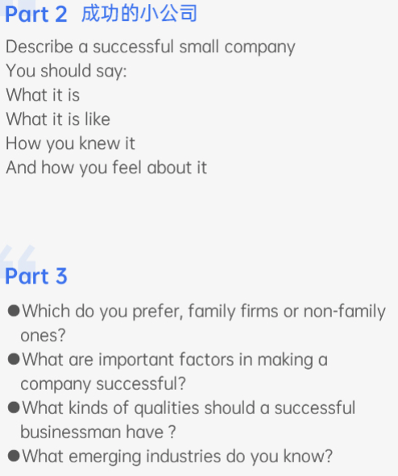

### 6-4

#### how
- once a internship in this company, make vr game, wonderful team, on internet, 
- help children with interllectual disabilities(mental retardation), virtual environment, simulated the surroundings of the school,
- Children with IDs have significant difficulties in both intellectual functioning (e.​g. communicating, learning, problem solving) and adaptive behavior (e.g.  everyday social skills, routines, hygiene).  
- feel proud and grateful(disadvantaged groups), team members are very kind -- leanred social skills(the importance of expressing gratitude), feel fulfilled(done jobs, leanred knowledge)
