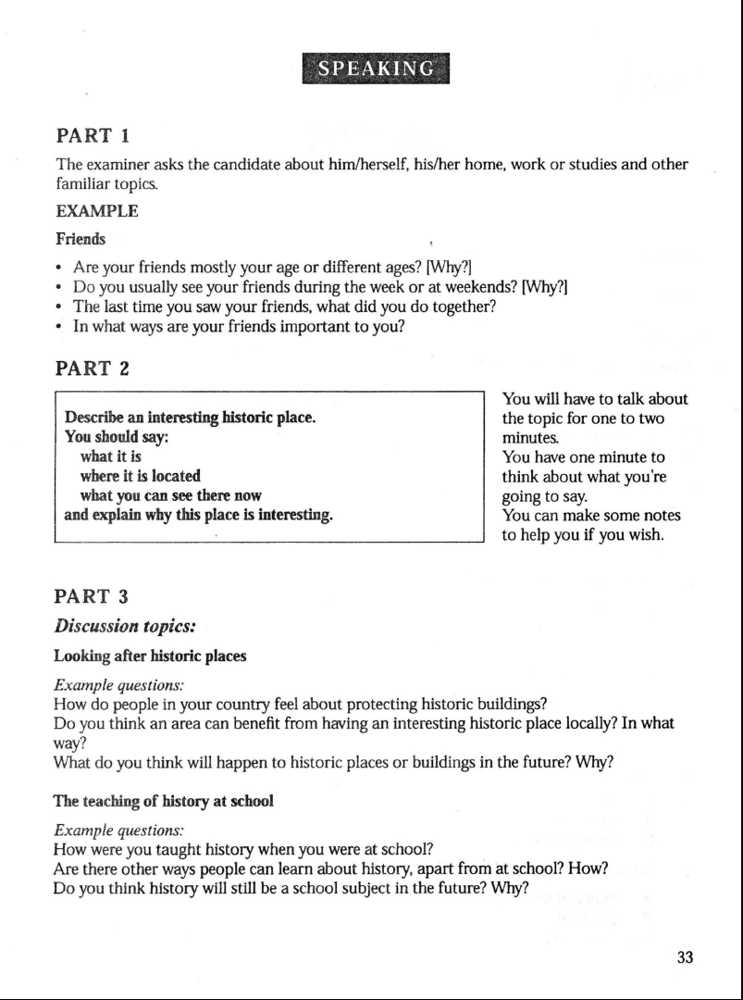
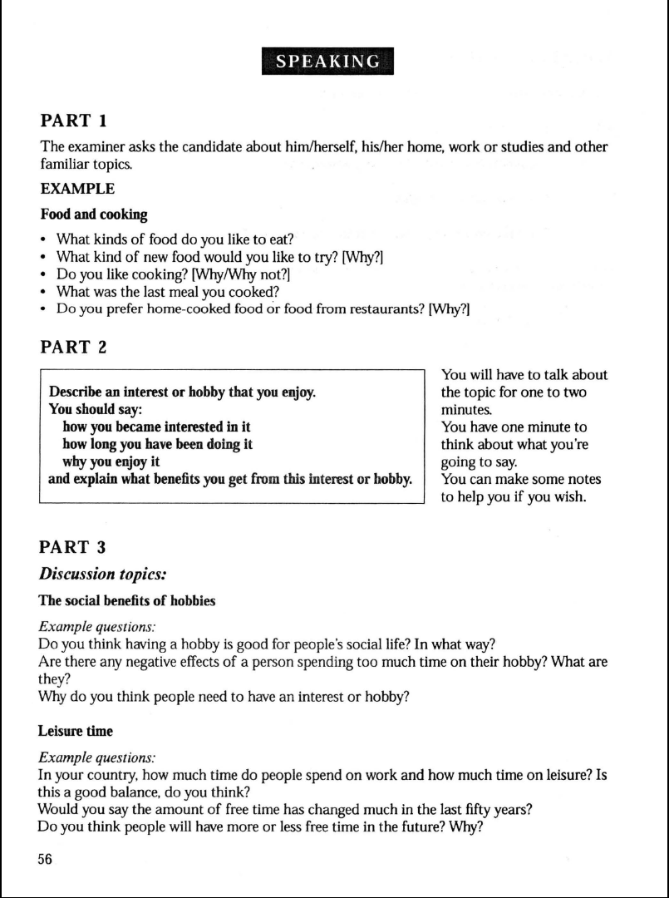
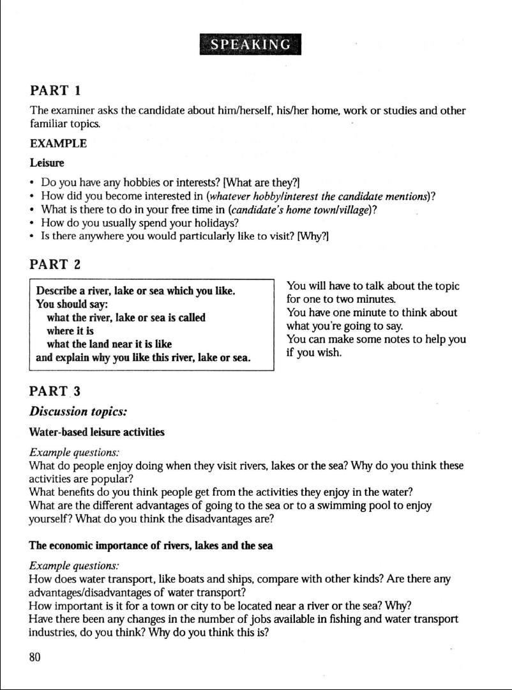
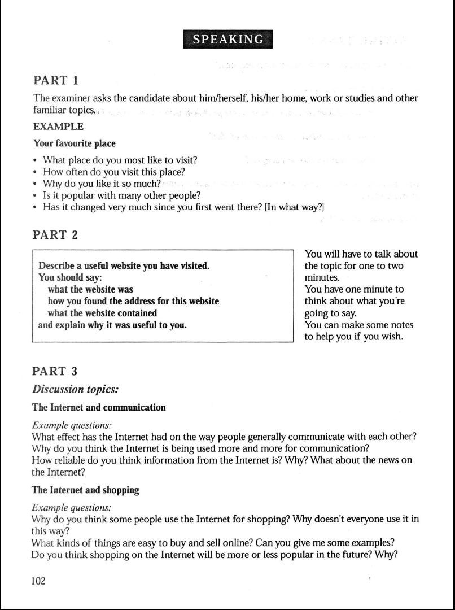
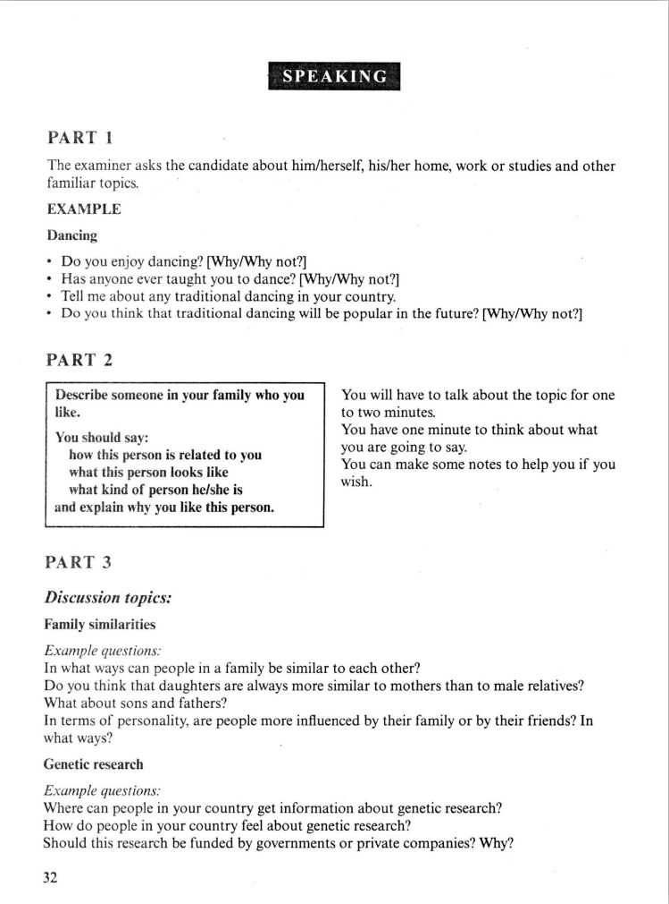
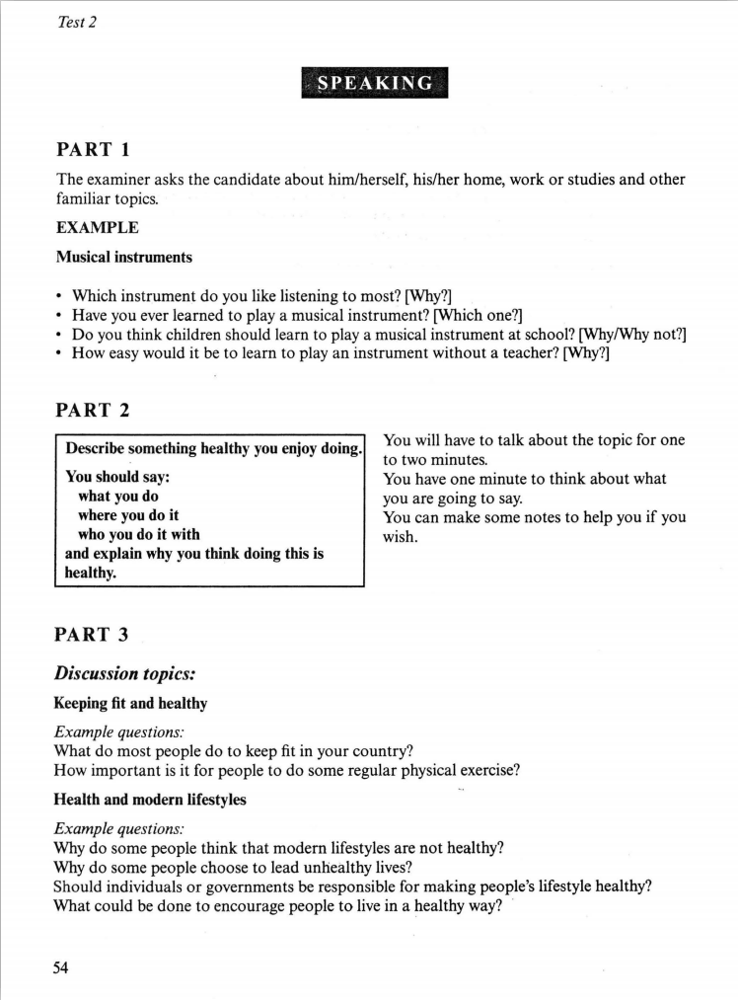
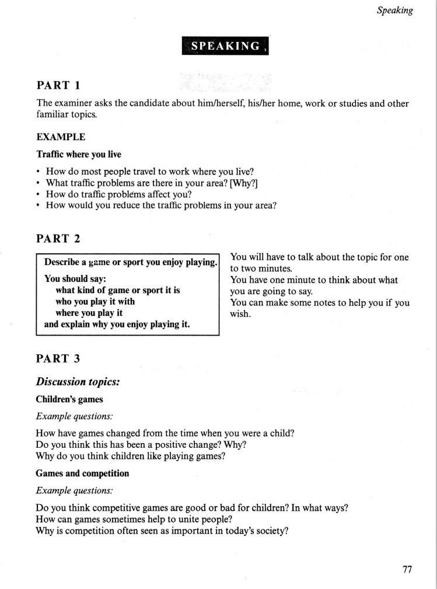
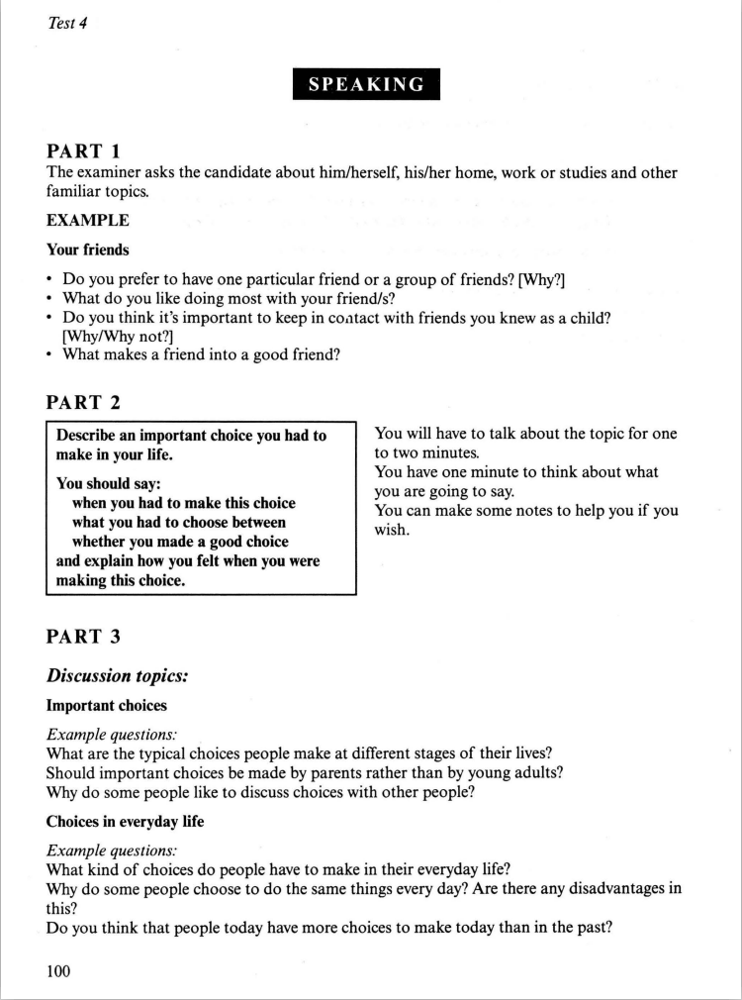

[toc]
### 4-1

#### how
- the great wall, one of the greatest wonders in the world, attracts millions of people, long wall stretches more than 5000 miles of northern borders of china, firstly build in Qin dynastry to protect Chinese against northern nations. beautiful senery of mountain, experience the ancient culture.
- the great wall itself is a spectacular building, many people were shoked by its magenificent including me
- can see beautiful senery of mountains, especially when visiting the undeveloped part of the great wall
- many arts like paintings, poems, operas inspired by the great wall, mengjiangnv cried so sad that part of the wall was cried down. 
---
### 4-2

#### how
---
### 4-3

#### how
- a rivers near my hometown, named dongliuhe means a river with its water flowing west
river lies between mountains, 100 meters wide.
- fish in the river is delicious/ tasty
- swim in this river
- fish in my leisure time for relaxing
---

### 4-4

#### how
- youtube, baned in china, get to know it through a friends, contains a huge amount of videos of all kinds, mostly uploaded by ordinary people.
- leisure time, relax, hilarious stories
- learn different culture
- improve my program skills, understand c prime plus with the help of a guy.
---

### 6-1

#### how
- sister, relation, looks like(beautiful, about the same height as me, wear glasses(because))
- she is kind, example, huang out(shoping movie), help tramps, told me to be a kind person
- she have always been taking care of me. difficulty/sick
- admire, brave, the very quality i lack in my personality
---

### 6-2

#### how
- cycling long distance cycling, all most three years, in the city, around lack moutains, mostly by my own, some time with friends
- improves my mental well-being, geting away from daily routine, without conserns worries, suffer from depressing,
- promote weight loss, inactive life style, burning weight, obecity, overweight
- build muscle strength, loss muscle tissus
- in long-term perspective, keep me away from disease like cancer and diabetes, chronic illnesses
---

### 6-3

#### how
- cycling long distance cycling, all most three years, in the city, around lack moutains, mostly by my own, some time with friends
- beautiful senery of moutains villages rivers and lakes
- for health, both mental health and physical health
- promote weight loss, build muscle strength, atfer finishing trip feel comfortable thought exausting during the riding
- experience local culture food
- broadens my social circle promotes my social skills
---
### 6-4

#### how
- in my college, choose between working in a company or help my teacher in the lab, made the right choice
- at that time, most of my friends had already made their choice, so i was anxious
- fear, can't do well in a company, much harder
- sorry to my teacher
- expectation after made the choice, and then its a good choice, i learned a lot compared to my friends