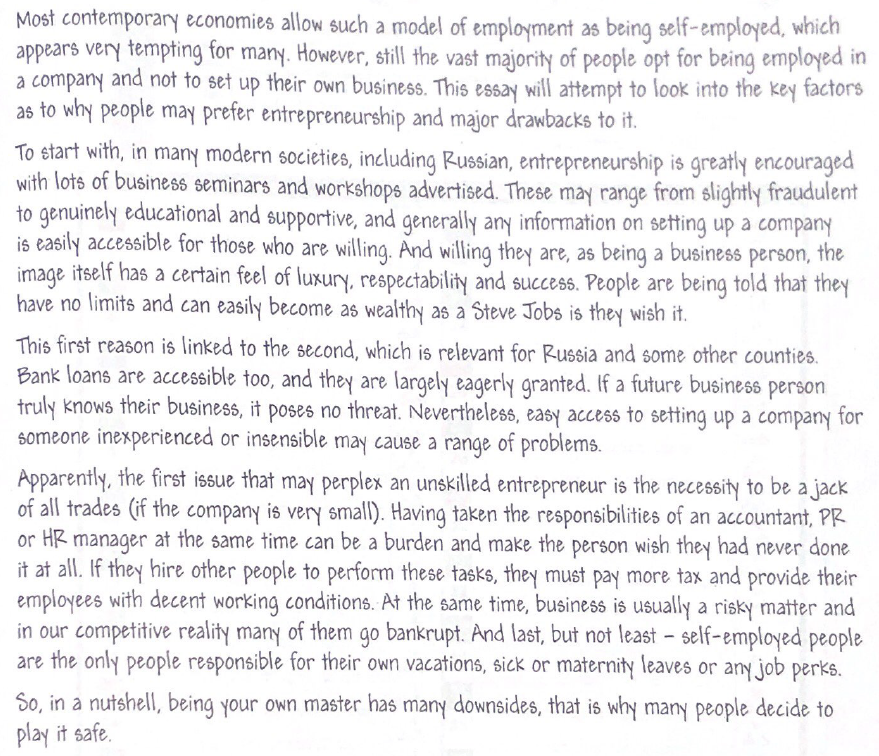

#### 文章

#### 单词/短语
- contemporary
- the vast majority of 
- opt for 
- as to
- to start with
- is easily accessible for
- nevertheless
- apparently
- perplex 困惑
- a jack of all trades
- at the same time
- in our competitive reality
- last but not least
- maternity leaves
- job perks
- in a nutshell

#### 句子
- This essay will look into the key factors as to why people may prefer entrepreneurship and the major drawbacks of it.